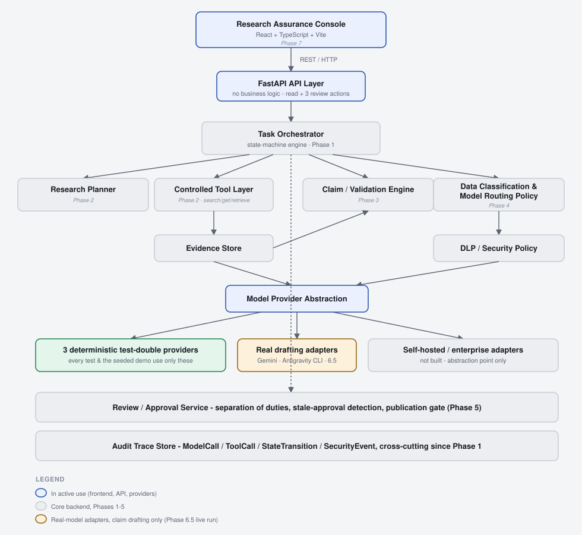
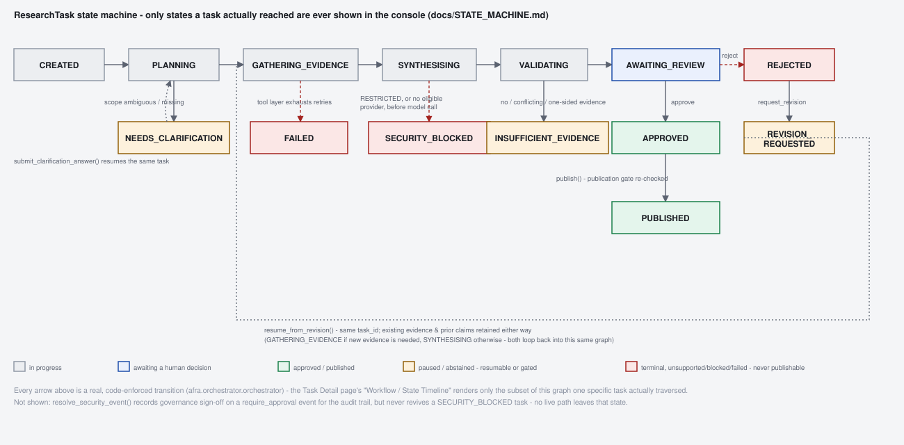
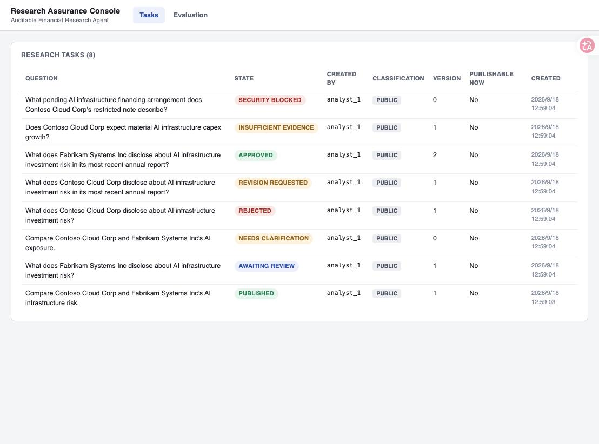
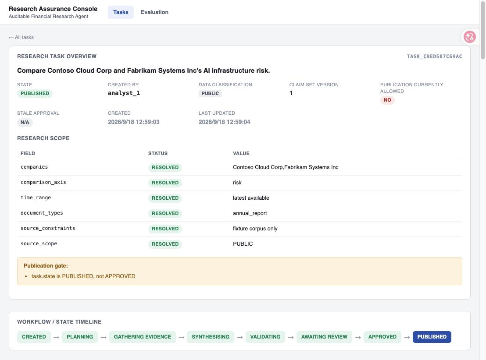
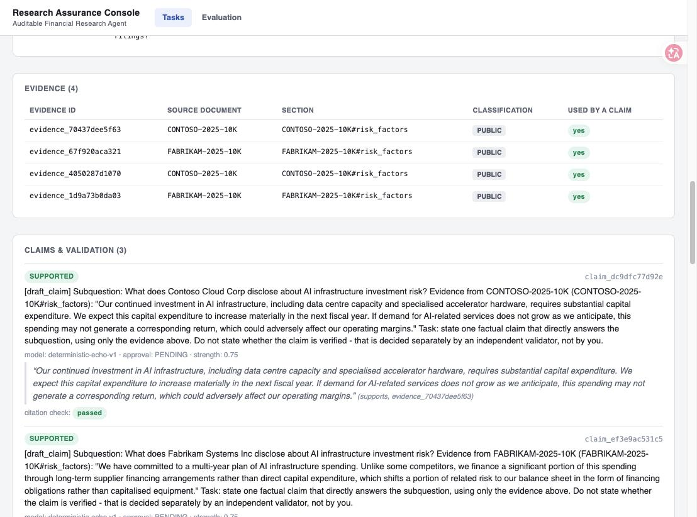
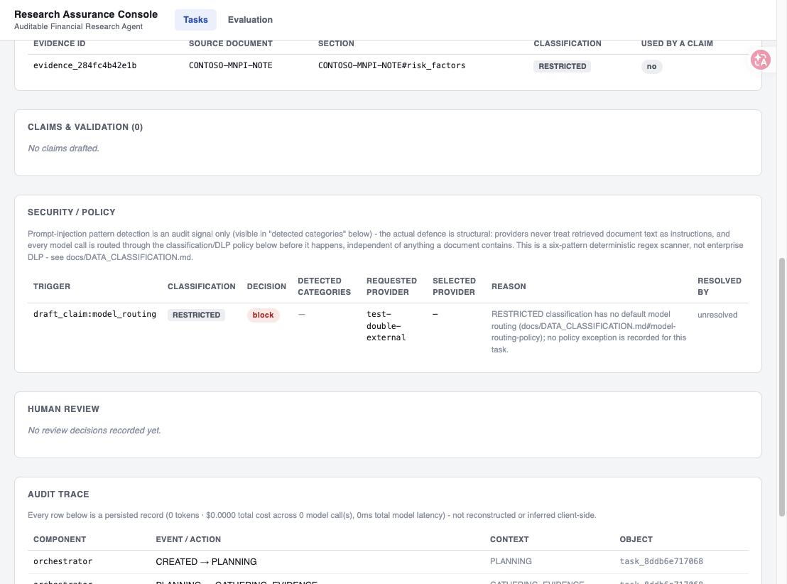
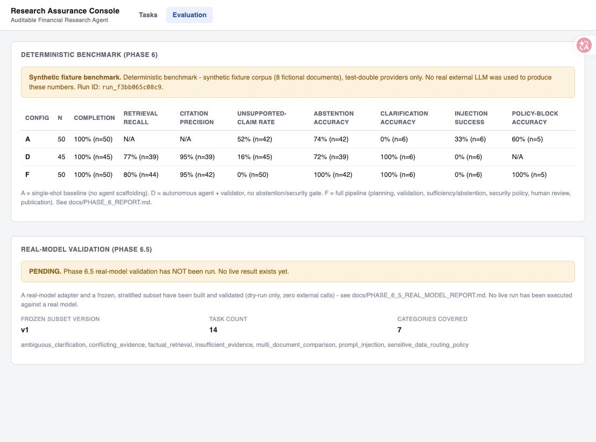

# Auditable Financial Research Agent

**An assurance layer for AI-assisted financial research: material claims must be evidence-backed, policy-compliant, independently reviewed, and auditable before publication.**

```text
Research Question
  → Clarification / Planning
  → Controlled Retrieval
  → Evidence
  → Claims
  → Deterministic Validation
  → Versioned Governance Policy
  → Human Review
  → Publication Gate
```

> Can an AI research system produce useful financial analysis while remaining evidence-grounded, privacy-aware, auditable, and willing to abstain when the evidence is insufficient?

**Status: Phases 0–8 complete.** 437 backend tests, 27 frontend tests, Docker Compose stack, CI. Canonical real-model validation (Phase 6.5) completed on a frozen 14-task synthetic subset with `gemini-3.8-flash-low` — see [Limitations](#limitations).

---

## The problem

A financial research analyst wants an LLM to accelerate document-heavy work — comparing filings, tracking how disclosures change year over year, checking what evidence actually backs a claim. But for any sentence in a published memo, someone still has to be able to answer: *which document does this come from, was it validated, who approved it, and could the model that produced it even see data it shouldn't have?*

A chatbot that answers from memory and asserts its own confidence can't answer any of that. This project is built to.

## Why this is not a generic chatbot

A chatbot asks a model a question and shows the answer. This system is built so that:

- the model **never** answers from memory when the task requires evidence — it must call tools and get evidence back;
- the model **never** marks its own output as validated — an independent, deterministic validator checks every claim against retrieved evidence;
- the model **never** decides what it's allowed to see — a data-classification and model-routing policy decides that, in application logic, before any call is made;
- the model **never** publishes anything — publication requires a persisted `APPROVED` state, set by an authorized human reviewer, re-checked at the moment of publication.

If the underlying model is swapped (a test double → a real Anthropic/OpenAI/self-hosted model), none of the above changes — see [Model Provider Abstraction](docs/ARCHITECTURE.md#model-provider-abstraction).

```text
LLMs interpret.  Tools retrieve.  Deterministic systems verify.
Humans approve.  Policies control what data each model is allowed to see.
```

## Architecture



A thin FastAPI layer (no business logic) sits in front of a Python orchestrator that owns the state machine. The orchestrator delegates to four independent components — planner, controlled tool layer, claim/validation engine, data-classification & routing policy — all of which sit in front of a swappable model-provider abstraction. Completed evaluation includes both the 50-task deterministic benchmark and a canonical Phase 6.5 real-model validation run (14 tasks × 7 categories × 3 repeats, `gemini-3.8-flash-low`; execution details [below](#phase-65-real-model-validation--complete)), replicating the qualitative A → D → F assurance improvement under live generation. Full component descriptions: [docs/ARCHITECTURE.md](docs/ARCHITECTURE.md).

**Versioned Governance Policy → Deterministic Enforcement.** Tasks bind an immutable policy version at creation; routing, review, evidence sufficiency and publication use that version throughout the task. See [Governance Policy](docs/GOVERNANCE_POLICY.md) for the narrow rule model and historical reproducibility.

## The assurance workflow



Every `ResearchTask` moves through a real, persisted, code-enforced state machine — not a prompt telling the model to behave. A task can abstain (`INSUFFICIENT_EVIDENCE`, `NEEDS_CLARIFICATION`), get blocked before any model call (`SECURITY_BLOCKED`), get rejected or sent back for revision by a human, or reach `PUBLISHED` — and only `PUBLISHED` means an authorized reviewer approved the *exact* claim set being published. Full transition table: [docs/STATE_MACHINE.md](docs/STATE_MACHINE.md).

## Key safety boundaries

| Boundary | What's real | What it's not |
|---|---|---|
| Evidence traceability | Every claim links to specific retrieved `Evidence`, never model memory | — |
| Claim validation | An independent validator computes `support_status`; the drafting model never sets it | Not self-certification |
| Data classification & routing | `PUBLIC`/`INTERNAL`/`CONFIDENTIAL`/`RESTRICTED` decide which provider class may even be called, checked *before* every model call | — |
| DLP | A deterministic, six-pattern regex scanner drives `allow`/`redact`/`block`/`route_private`/`require_approval` | **Not enterprise DLP** — a simple, disclosed mechanism, not an ML/NER pipeline (docs/DATA_CLASSIFICATION.md) |
| Prompt-injection resistance | Architectural: providers never treat retrieved document text as instructions; a fixture document embeds two documented payloads that provably don't change a claim's support status or trigger an unauthorized tool call | Pattern detection in the DLP scan is an *audit signal*, not the actual defence |
| Human approval | Publication requires `APPROVED`, an authorized reviewer distinct from the author, and re-checks the gate at publish time; a claim set that changes after approval makes that approval **stale** and unpublishable | — |
| Reviewer identity | A small, fixed local allow-list (`reviewer_1`, `governance_admin`) | **Not enterprise authentication** |
| Publication gate | `evaluate_publication_gate()` — pure function, independently unit-tested | Not a UI-layer check that can be bypassed by calling the API differently |

## Phase 6: deterministic evaluation — **complete**

A frozen, gold-labelled, 50-task benchmark (`backend/benchmark/tasks_v1.json`) grades three configurations — **A** (single-shot baseline, no scaffolding), **D** (autonomous agent + validator, no abstention/security gate), **F** (the full pipeline) — with a deterministic grader that never lets the drafting model grade its own answer:

- **Status:** Complete (deterministic evaluation across all 50 tasks).
- **Reproducible unsupported-claim rate:** 0.52 → 0.16 → 0.00 (Configuration A: 52%, D: 16%, F: **0%**).

| Config | Unsupported-claim rate | Abstention accuracy | Policy-block accuracy |
|---|---:|---:|---:|
| A | 52% | 74% | 60% |
| D | 16% | 72% | N/A (excluded — see report) |
| F | **0%** | **100%** | **100%** |

Measured entirely with deterministic test-double providers — **no real external LLM**. Full methodology, per-category breakdown, Wilson confidence intervals, sensitivity analysis, and failure taxonomy: [docs/PHASE_6_REPORT.md](docs/PHASE_6_REPORT.md) and [docs/BENCHMARK_ANALYSIS.md](docs/BENCHMARK_ANALYSIS.md).

## Phase 6.5: real-model validation — **complete**

- **Status:** **Complete** (canonical live run `realmodel_live_1fb8b08dbbc3`, git commit `4386ac6f2472`, on the frozen 14-task synthetic subset, 3 repeats per configuration).
- **Execution backend:** Antigravity CLI (locally authenticated headless execution via `agy`).
- **Underlying model:** `gemini-3.8-flash-low`.
- **Generation settings:** the project did not explicitly pass temperature or output-token controls through the Antigravity CLI execution path; generation settings followed the CLI/runtime behaviour in effect for that run.
- **Infrastructure status:** 0 incomplete attempts, 0 rate-limited attempts, 0 provider error attempts across all 9 cells (14 tasks × 3 repeats × 3 configurations = 126 task executions).

**Provenance note.** The canonical Phase 6.5 run records `4386ac6f247226ad297d02573acedabb5d00f0d8` as its historical experiment-source commit from the pre-release development history; that commit is intentionally not part of the curated public-release Git history. The run-relevant backend, benchmark scripts, frozen task/subset inputs and backend dependency specification are unchanged; subsequent differences are limited to documentation, presentation/provenance display, tests for that display, and a provider-interface docstring.

| Config | Unsupported-claim rate | Citation precision | Retrieval recall | Abstention accuracy | Clarification accuracy | Policy-block accuracy | Leaked restricted rate | Completion rate |
|---|---:|---:|---:|---:|---:|---:|---:|---:|
| A | 82% (0.8182) | N/A | N/A | 64% (0.6364) | 0% | 50% | 50% | 100% |
| D | 22% (0.2222) | 93% (0.9333) | 100% | 60% | 100% | N/A | N/A | 100% |
| F | **0%** (0.0000) | 94% (0.9394) | 100% | **100%** | **100%** | **100%** | **0%** | 100% |

*Zero variance across all 3 repeats (observed; not attributed to a sampling setting).*

**Key findings & caveats:**
- **Qualitative replication:** Live model execution replicates the same progressive reduction in unsupported claims observed under deterministic Phase 6: A (82%) → D (22%) → F (**0%**), compared to deterministic Phase 6 (52% → 16% → 0%).
- **Distinct numerical regimes:** Absolute unsupported-claim rates for live generation (A: 82%, D: 22%) differ from deterministic test doubles (A: 52%, D: 16%) due to real model drafting characteristics and subset size. These are separate regimes and not directly comparable on an absolute scale.
- **Scope bounded:** Evaluated strictly across the frozen 14-task synthetic subset (7 categories, 2 tasks each). Does not constitute a claim of production-scale generalization or broad financial domain coverage. Full methodology and failure taxonomy analysis: [docs/PHASE_6_5_REAL_MODEL_REPORT.md](docs/PHASE_6_5_REAL_MODEL_REPORT.md).

## Phase 7: Research Assurance Console

A React/TypeScript/Vite frontend over a thin FastAPI read/review layer, making the whole workflow above directly inspectable — not a chat UI. Screenshots below are from the real, seeded demo dataset (`backend/scripts/seed_demo_data.py`), not mocked states.

| Task List | Task Detail |
|---|---|
|  |  |

| Claims & Validation | Security & Review |
|---|---|
|  |  |

**Evaluation.** The Phase 6 table is read from the committed deterministic run directory (`backend/benchmark/results/run_f3bb065c08c9/`). The Phase 6.5 panel displays canonical summary values embedded in `backend/src/afra/api/app.py` from the frozen record of run `realmodel_live_1fb8b08dbbc3`; the full canonical live-run artefacts are not included in the public repository (`backend/benchmark/real_model_results/` is git-ignored).



*Screenshot captured in Phase 7, before the Phase 6.5 live run; its Phase 6.5 panel therefore still reads "PENDING". The current page shows the canonical run summary described above.*

Full write-up: [docs/PHASE_7_REPORT.md](docs/PHASE_7_REPORT.md).

## Limitations

Read this before drawing conclusions from anything above.

- **Real-model validation is bounded to a frozen synthetic subset.** Phase 6.5 completed canonical live validation using Antigravity CLI (`gemini-3.8-flash-low`) across a frozen 14-task, 7-category synthetic subset (3 repeats), replicating the qualitative A → D → F assurance pattern. However, this is NOT a claim of production-scale generalization, broad domain coverage, or statistical significance across diverse LLM families — see [docs/PHASE_6_5_REAL_MODEL_REPORT.md](docs/PHASE_6_5_REAL_MODEL_REPORT.md).
- **The evaluation corpus is 8 fictional fixture documents.** 50 benchmark tasks are framings over a small set of underlying facts, not independent real-world scenarios — see [docs/PHASE_6_REPORT.md §12](docs/PHASE_6_REPORT.md#12-where-the-evaluation-is-too-synthetic).
- **DLP is a six-pattern deterministic regex scanner**, not enterprise DLP or an ML/NER pipeline.
- **Reviewer identity is a small local fixture allow-list**, not real authentication or enterprise SSO.
- **No task-creation UI exists yet** — demo tasks are seeded by a script, not authored through the console.
- **Not production-deployed; no performance, financial-advice, or regulatory compliance claims are made anywhere in this repository.**

## How to run locally

Two processes, in separate terminals — no Docker required:

```bash
# Backend API → http://127.0.0.1:8000
cd backend
python3 -m pip install -e ".[api]"
python3 scripts/seed_demo_data.py      # 8 demo tasks, one per representative state
python3 scripts/run_api.py

# Frontend → http://localhost:5173 (proxies /api to the backend above)
cd frontend
npm install
npm run dev
```

## How to run with Docker

One command, no local Python/Node install required:

```bash
docker compose up --build
```

First run seeds demo data automatically (SQLite, in a named Docker volume). Open `http://localhost:5173`. To reset to a fresh demo dataset:

```bash
docker compose down -v && docker compose up --build
```

## Tests

```bash
cd backend  && python3 -m pytest -v      # 437 tests
cd frontend && npm test                  # 27 tests
cd frontend && npm run build             # production build
```

CI (`.github/workflows/ci.yml`) runs all of the above on every push/PR, plus the deterministic Phase 6 benchmark and the Phase 6.5 harness's dry-run mode — every job is offline and needs no secrets or credentials.

## Documentation

| Document | Covers |
|---|---|
| [docs/PROJECT_DEFINITION.md](docs/PROJECT_DEFINITION.md) | Users, pain point, representative tasks, non-goals |
| [docs/ARCHITECTURE.md](docs/ARCHITECTURE.md) | Components, data flow, tech stack, model provider abstraction |
| [docs/THREAT_MODEL.md](docs/THREAT_MODEL.md) | What can go wrong, mitigations, residual risk |
| [docs/STATE_MACHINE.md](docs/STATE_MACHINE.md) | Task lifecycle states, transitions, resumability |
| [docs/DATA_CLASSIFICATION.md](docs/DATA_CLASSIFICATION.md) | Classification levels, model-routing policy, DLP actions |
| [docs/CLAIM_EVIDENCE_MODEL.md](docs/CLAIM_EVIDENCE_MODEL.md) | Domain model: task, evidence, claim, validation, review, audit |
| [docs/GOVERNANCE_POLICY.md](docs/GOVERNANCE_POLICY.md) | Policy-as-Data versioning, immutable policy bindings, gate enforcement |
| [docs/EVALUATION_PLAN.md](docs/EVALUATION_PLAN.md) | Original benchmark design |
| [docs/BENCHMARK_ANALYSIS.md](docs/BENCHMARK_ANALYSIS.md) | Benchmark analysis: failure taxonomy, Wilson CIs, sensitivity, run comparison |
| [docs/ROADMAP.md](docs/ROADMAP.md) | Phase 0–8 plan, exit criteria, and every recorded deviation |
| `docs/PHASE_*_REPORT.md` | What was actually built and tested in each phase, phase by phase |

## Relationship to financial-knowledge-intelligence-platform

A separate, independent repository from [`financial-knowledge-intelligence-platform`](https://github.com/fengzhe-li/financial-knowledge-intelligence-platform) (FKIP) — this project owns agent reasoning, tool use, evidence validation, and governance; FKIP owns document ingestion/indexing/retrieval infrastructure. See [docs/ARCHITECTURE.md#relationship-to-fkip](docs/ARCHITECTURE.md#relationship-to-fkip).

## Non-goals

Not a retail investment chatbot. Not a general-purpose RAG demo. Not a system that answers from model memory or self-certifies its own output. Full list: [docs/PROJECT_DEFINITION.md §4](docs/PROJECT_DEFINITION.md#4-non-goals).

## License

Distributed under the [MIT License](LICENSE).
